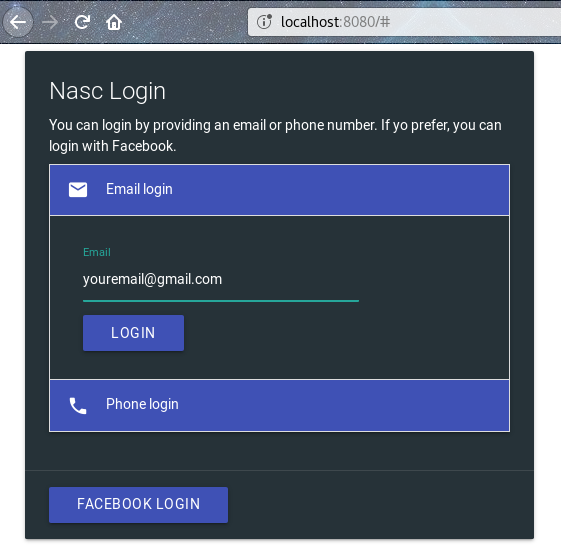
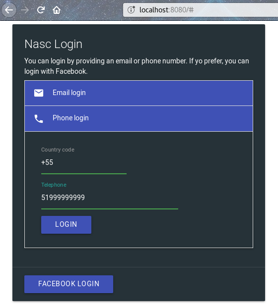
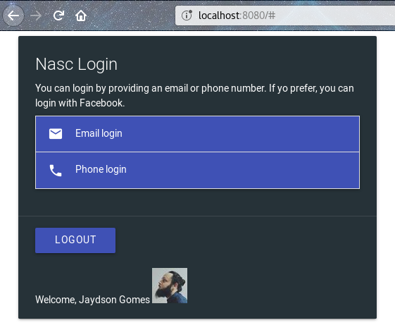
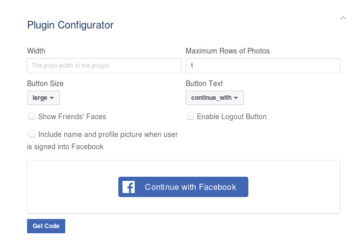
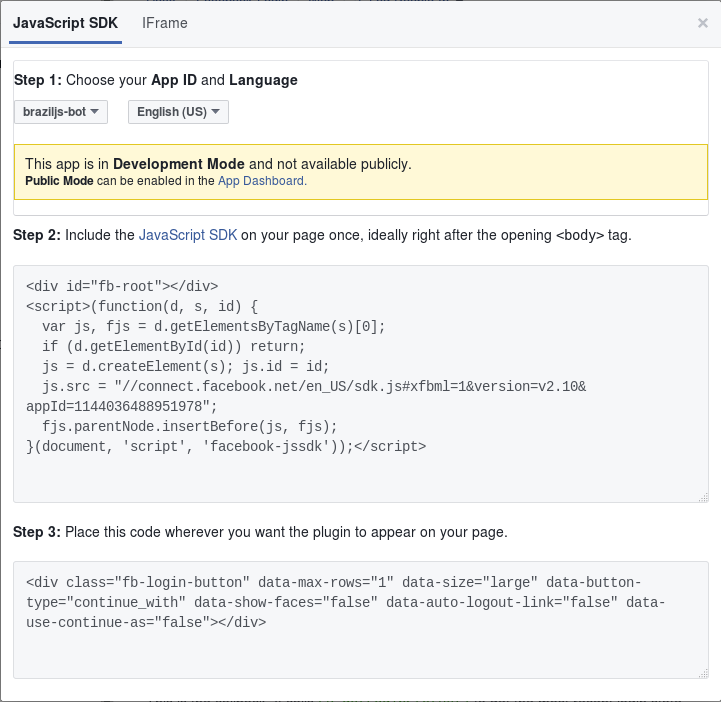
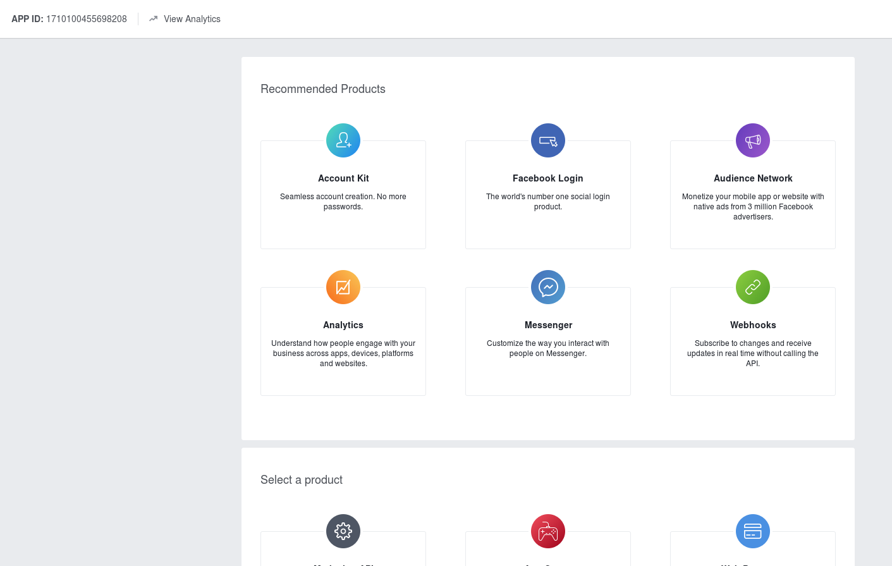

# Demo  
This repository contains the prototype demo exploring the Login and Account Kit API.  
You can test it by running the HTML index in your local server.  
If you're using Node.js, you cam instal the `http-server` package:  
```
npm install http-sever -g
```

and then:  
```
cd fb-login-account-kit-demo
http-server
```
Then you just open `localhost:8080` in your browser.  








# Facebook Login + Account Kit using the JavaScript SDK and Graph API

*Disclaimer: This is a working progress demo being developed by the global Facebook Developer Circles leads LATAM.  
The main focus here is prototype with actual code to learn all caveats about Facebook Login and Account Kit API for a better understanding.  
This material will be used in the new workshops Facebook Developer Circles is promoting across communities.*  

## Facebook login button
There are several ways we can implement the Facebook login Button.  
With the ["Plugin Configurator"](https://developers.facebook.com/docs/facebook-login/web#loginbutton) you can easily configure a custom Facebook Button for your application.  
  

After your custom button is ready, you can just get the code and paste into your application.  
  

## Facebook login SDK
Another way of implement the login button is working directly with the JavaScript SDK.  
You can even use your own button, like an HTML default button or using your style guide.  

_1. Adding the Facebook SDK_  
First thing to do is load the JavaScript Facebook SDK.  
```
// Loading dinamically the Facebook SDK
(function(d, s, id){
  var js, fjs = d.getElementsByTagName(s)[0];
  if (d.getElementById(id)) {return;}
  js = d.createElement(s); js.id = id;
  js.src = "//connect.facebook.net/en_US/sdk.js";
  fjs.parentNode.insertBefore(js, fjs);
}(document, 'script', 'facebook-jssdk'));
```
This piece of code will add a script dinamically in your web page and will load the JavaScript Facebook SDK.  

_2. initialize_  

Now, let's initialize the Facebook SDK:  
```
window.fbAsyncInit = function() {
    FB.init({
      appId : 'YOUR_APP_ID',
      cookie : true,
      xfbml : true,
      version : 'v1.1'
    });
};
```
Replace `YOUR_APP_ID` using your own appId.  
Below, on the "Getting your APP ID" section, you can check how to get one if you don't have it yet.  

_3. Create your button_  
As said before, you can have your own Facebook login button.  
Let's implement a simple standard HTML button:  
```
<button id="fb-login" onclick="fbLogin();" class="your_cool_style">Facebook Login</button>
```
Include the `fb-login` button in your application, and then implement the login function.  

_4. The login function_  
```
FB.login(function(response) {
  if (response.status === 'connected') {
    // Logged into your app and Facebook.
  } else {
    // The person is not logged into this app or we are unable to tell. 
  }
});
```
_5. Logout_  
For logout, you can use the `logout` method available on the API.  
```
FB.logout((response) => {
    console.log(response)
});
```

## Facebook Account Kit
The Facebook Account Kit lets people quickly register for and login to your app by using just their phone number or email address — no password needed.  
It's reliable, easy to use and gives you a choice about how you sign up for apps.  
Let's see hot to implement it using the JavaScript SDK.  

_1. Include the SDK in your application_  
```
<!-- HTTPS required. HTTP will give a 403 forbidden response -->
<script src="https://sdk.accountkit.com/en_US/sdk.js"></script>
```
PS: You can use the same approach we used in the login button example, adding the script dinamically.  

2. Create email and phone fields
```
<input value="+1" id="country_code" />
<input placeholder="phone number" id="phone_number"/>
<button onclick="smsLogin();">Login via SMS</button>
<div>OR</div>
<input placeholder="email" id="email"/>
<button onclick="emailLogin();">Login via Email</button>
    
```
_3. initialize_  
```
AccountKit_OnInteractive = function(){
AccountKit.init({
    appId:"{{FACEBOOK_APP_ID}}", 
    state:"{{csrf}}", 
    version:"{{ACCOUNT_KIT_API_VERSION}}",
    fbAppEventsEnabled:true,
    redirect:"{{REDIRECT_URL}}"
    }
);
```

_4. Login_  
Both with phone and email, you should call the `login` method available on the AccountKit API.  
For example, for the email login:  
```
// email form submission handler
function emailLogin() {
  var emailAddress = document.getElementById("email").value;
  AccountKit.login(
    'EMAIL',
    {emailAddress: emailAddress},
    loginCallback
  );
}
```

Sms login:  
```
function smsLogin() {
  var countryCode = document.getElementById("country_code").value;
  var phoneNumber = document.getElementById("phone_number").value;
  AccountKit.login(
    'PHONE', 
    {countryCode: countryCode, phoneNumber: phoneNumber}, // will use default values if not specified
    loginCallback
  );
}
```
Now you just need to implement the `loginCallback` function, which will handle the email and sms login:  
```
function loginCallback(response) {
  if (response.status === "PARTIALLY_AUTHENTICATED") {
      var code = response.code;
      var csrf = response.state;
  }
  else if (response.status === "NOT_AUTHENTICATED") {
      // handle authentication failure
  }
  else if (response.status === "BAD_PARAMS") {
      // handle bad parameters
  }
}
```

## Getting your APP ID
Go to [https://developers.facebook.com/](https://developers.facebook.com/) and click on "Create a new App".  
  

You should see all Facebook products in the next screen:  
  
