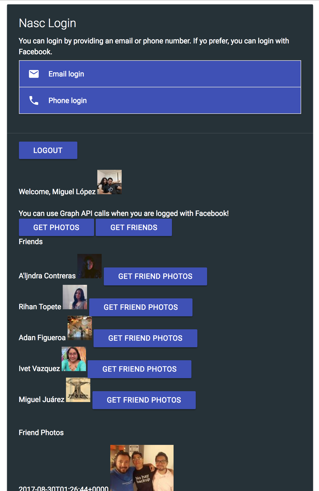
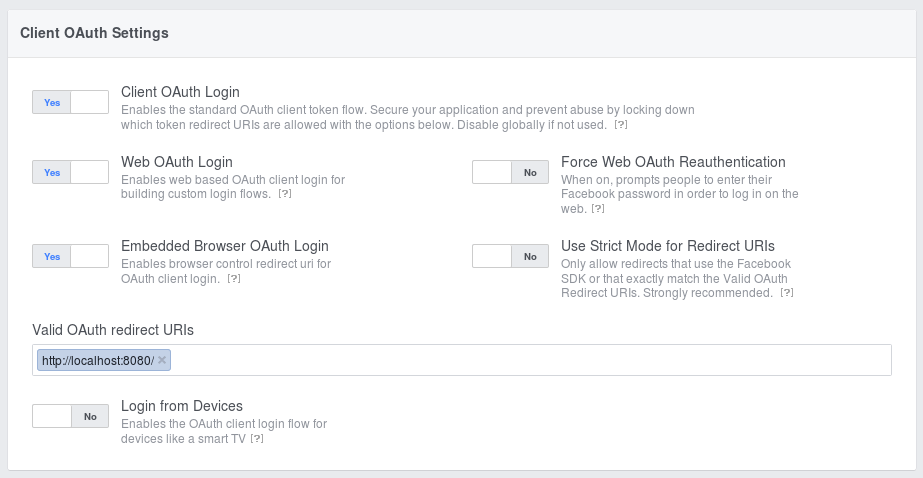
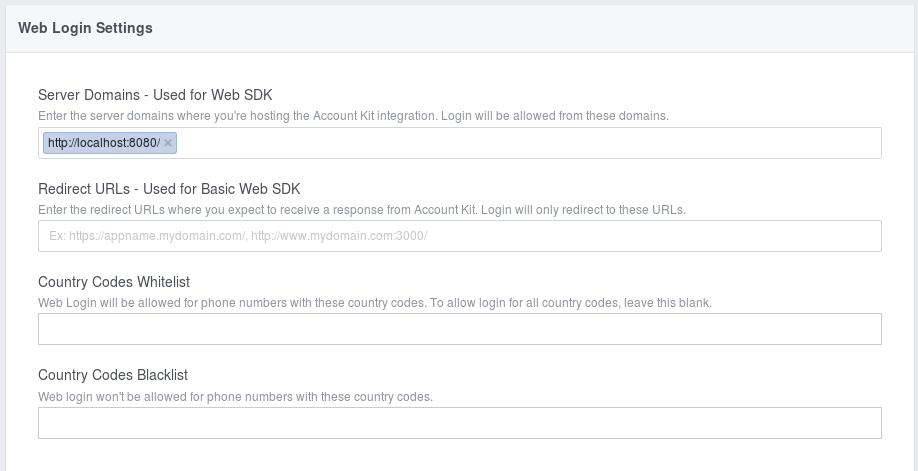
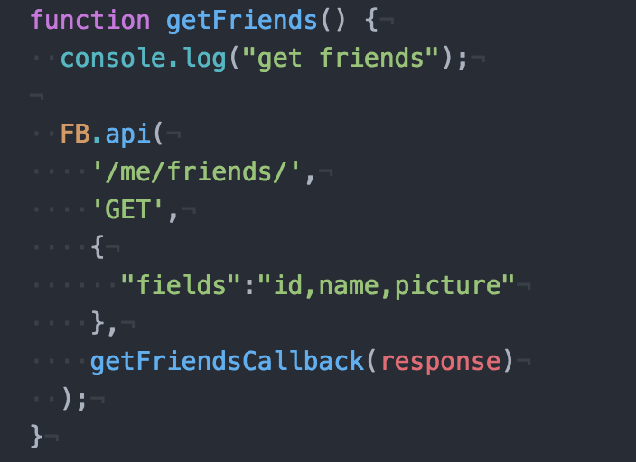
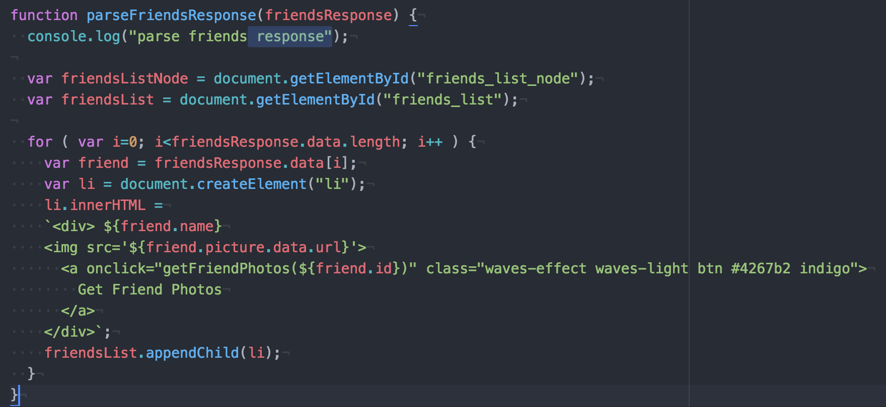
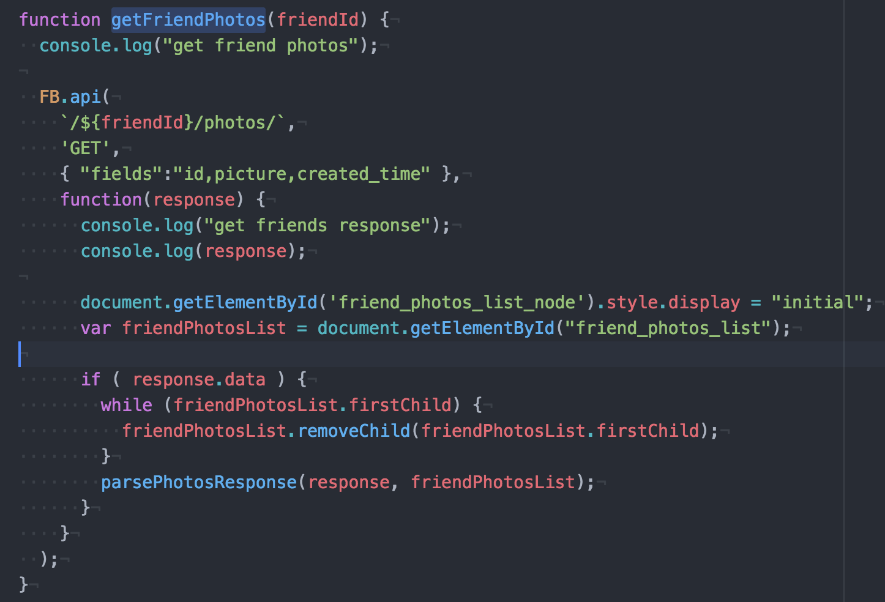
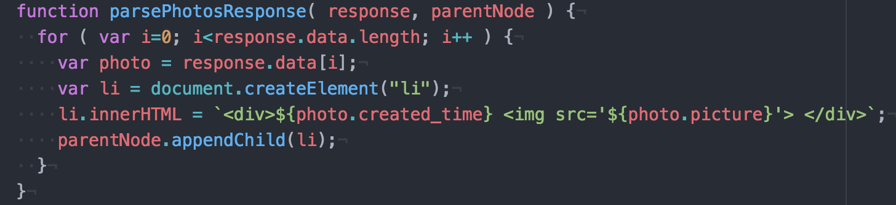

# Facebook Login + Account Kit using the JavaScript SDK and Graph API

*Disclaimer: This is a working progress demo being developed by the global Facebook Developer Circles leads LATAM.  
The main focus here is prototype with actual code to learn all caveats about Facebook Login and Account Kit API for a better understanding.  
This material will be used in the new workshops Facebook Developer Circles is promoting across communities.*  

# Demo  
This repository contains the prototype demo exploring the Login and Account Kit API.  
You can test it by running the HTML index in your local server.  
If you're using Node.js, you cam instal the `http-server` package:  
```
npm install http-server -g
```

navigate in to the project directory with:
```
cd fb-login-account-kit-demo
```

install project dependencies(CSS and JS libs) by running:
```
npm install
```

and then run the server:
```
http-server
```
Then you just open `localhost:8080` in your browser.  



Graph API demo

## Facebook login button
There are several ways we can implement the Facebook login Button.  
With the ["Plugin Configurator"](https://developers.facebook.com/docs/facebook-login/web#loginbutton) you can easily configure a custom Facebook Button for your application.  
  

After your custom button is ready, you can just get the code and paste into your application.  
  

## Facebook login SDK
Another way of implement the login button is working directly with the JavaScript SDK.  
You can even use your own button, like an HTML default button or using your style guide.  

_1. Adding the Facebook SDK_  
First thing to do is load the JavaScript Facebook SDK.  
```javascript
// Loading dinamically the Facebook SDK
(function(d, s, id){
  var js, fjs = d.getElementsByTagName(s)[0];
  if (d.getElementById(id)) {return;}
  js = d.createElement(s); js.id = id;
  js.src = "//connect.facebook.net/en_US/sdk.js";
  fjs.parentNode.insertBefore(js, fjs);
}(document, 'script', 'facebook-jssdk'));
```
This piece of code will add a script dinamically in your web page and will load the JavaScript Facebook SDK.  

_2. initialize_  

Now, let's initialize the Facebook SDK:  
```javascript
window.fbAsyncInit = function() {
    FB.init({
      appId : 'YOUR_APP_ID',
      cookie : true,
      xfbml : true,
      version : 'v1.1'
    });
};
```
Replace `YOUR_APP_ID` using your own appId.  
Below, on the "Getting your APP ID" section, you can check how to get one if you don't have it yet.  

_3. Create your button_  
As said before, you can have your own Facebook login button.  
Let's implement a simple standard HTML button:  
```html
<button id="fb-login" onclick="fbLogin();" class="your_cool_style">Facebook Login</button>
```
Include the `fb-login` button in your application, and then implement the login function.  

_4. The login function_  
```javascript
FB.login(function(response) {
  if (response.status === 'connected') {
    // Logged into your app and Facebook.
  } else {
    // The person is not logged into this app or we are unable to tell.
  }
});
```
_5. Logout_  
For logout, you can use the `logout` method available on the API.  
```javascript
FB.logout((response) => {
    console.log(response)
});
```

## Facebook Account Kit
The Facebook Account Kit lets people quickly register for and login to your app by using just their phone number or email address — no password needed.  
It's reliable, easy to use and gives you a choice about how you sign up for apps.  
Let's see hot to implement it using the JavaScript SDK.  

_1. Include the SDK in your application_  
```html
<!-- HTTPS required. HTTP will give a 403 forbidden response -->
<script src="https://sdk.accountkit.com/en_US/sdk.js"></script>
```
PS: You can use the same approach we used in the login button example, adding the script dinamically.  

2. Create email and phone fields
```html
<input value="+1" id="country_code" />
<input placeholder="phone number" id="phone_number"/>
<button onclick="smsLogin();">Login via SMS</button>
<div>OR</div>
<input placeholder="email" id="email"/>
<button onclick="emailLogin();">Login via Email</button>

```
_3. initialize_  
```javascript
AccountKit_OnInteractive = function(){
AccountKit.init({
    appId:"{{FACEBOOK_APP_ID}}",
    state:"{{csrf}}",
    version:"{{ACCOUNT_KIT_API_VERSION}}",
    fbAppEventsEnabled:true,
    redirect:"{{REDIRECT_URL}}"
    }
);
```
Note: The {{csrf}} placeholder should be replaced with a non-guessable value that should originate in the app's server and be passed to the login flow. It is returned back to the app client unchanged, and the app client can pass it back to server to verify the match with the original value.  
know more about CSRF protection: [https://www.owasp.org/index.php/Cross-Site_Request_Forgery_(CSRF)](https://www.owasp.org/index.php/Cross-Site_Request_Forgery_(CSRF))  

_4. Login_  
Both with phone and email, you should call the `login` method available on the AccountKit API.  
For example, for the email login:  
```javascript
// email form submission handler
function emailLogin() {
  var emailAddress = document.getElementById("email").value;
  AccountKit.login(
    'EMAIL',
    {emailAddress: emailAddress},
    loginCallback
  );
}
```

Sms login:  
```javascript
function smsLogin() {
  var countryCode = document.getElementById("country_code").value;
  var phoneNumber = document.getElementById("phone_number").value;
  AccountKit.login(
    'PHONE',
    {countryCode: countryCode, phoneNumber: phoneNumber}, // will use default values if not specified
    loginCallback
  );
}
```
Now you just need to implement the `loginCallback` function, which will handle the email and sms login:  
```javascript
function loginCallback(response) {
  if (response.status === "PARTIALLY_AUTHENTICATED") {
      var code = response.code;
      var csrf = response.state;
  }
  else if (response.status === "NOT_AUTHENTICATED") {
      // handle authentication failure
  }
  else if (response.status === "BAD_PARAMS") {
      // handle bad parameters
  }
}
```

## Getting your APP ID
Go to [https://developers.facebook.com/](https://developers.facebook.com/) and click on "Create a new App".  

  

You should see all Facebook products in the next screen:  

  

Add the products you want to use.  
For this demo we're using **Facebook Login** and **Account Kit**.  

## Configuring Facebook Login
You must define a **valid OAuth redirect URIs** in the Facebook Login settings.  
In development mode you probably should add something like `localhost`.  
For this demo we're using `localhost:8080`.  
Keep in mind that you shuold update this when your application is ready for production, so you'll need to add the production URL as well (e.g: `mywebsitewithfacebooklogin.com`).  



## Configuring Account Kit
You must define a **valid Server Domains - Used for Web SDK** in the Facebook Account Kit settings.  
In development mode you probably should add something like `localhost`.  
For this demo we're using `localhost:8080`.  
Keep in mind that you shuold update this when your application is ready for production, so you'll need to add the production URL as well (e.g: `mywebsitewithaccountkit.com`).  



## Making Graph API Calls with JS SDK

The Graph API allows us to access to information that our users previously shared with Facebook. Using this information we can personalize and enrich the user experience in powerful ways.

With the Facebook login the user allows us to access to it's basic information such as name and profile picture. In order to access extra information we need to explicitly request permission to the user. We can do this in the Facebook Login dialog indicating each permission that we require in the scope param or we can asks for permission at any point in our application.

The Graph API can be queried using any stack of tools that allows to make HTTP request. This stack will change depending on the platform of our project. In this demo the basic user info like name and profile picture is obtained making HTTP calls using fetch.

The Facebook SDKs for each platform includes functions that allows easier handling of the requests to the Graph API. In the JS SDK you use the FB.api function to make a request to the Graph API.



This function needs the following params:
* The path to the Graph API endpoint that you want to query
* The HTTP method of the request
* An object containing the params of the request
* A callback function to handle the response.

In the callback function of a Graph API request you will parse the response data and use it to perform some function of your app like modifying the app state or displaying info to the user.

In the previous Graph API request we retrieve info of the user's friends, and in the following function we parse that function response in order to show a list of friends in the UI of our app.



In this parse function we traverse the response object and create DOM nodes for each of the objects in the response. We populate this nodes with each object info and show all of this into the UI.

We can create more complex Graph API requests that could even require info obtained in previous request. For example, in this demo we request from each of the users in the friends list that we build before. This request and it's callback and response parse functions will look like this:





We can see that the Graph API request follows some patterns between them. You create a request with an specific endpoint and params, you parse the response in a callback function and finally you make use of this response in your app.
